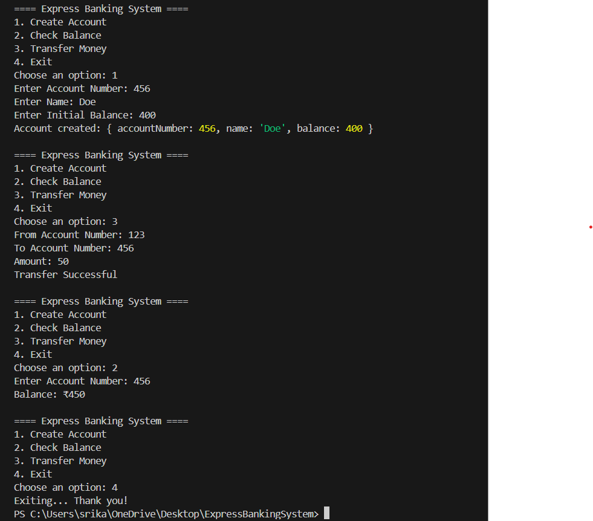

# Express Banking System

## Overview

The **Express Banking System** is a secure, interactive application designed to simulate real-world banking operations, including account creation, balance checking, and fund transfers. Built using **JavaScript**, this project utilizes data structures like **Linked List** and **Binary Search Tree** to efficiently manage accounts and perform transactions.

## Features

- **Create Account**: Add new customer accounts with an account number, name, and balance.
- **Check Balance**: Retrieve the balance of any existing account.
- **Transfer Money**: Transfer funds between two accounts, given sufficient balance.
- **Data Structures**: Implements **Linked List** and **Binary Search Tree** for account management.

## Tools & Technologies

- **JavaScript**: The primary language for building the application.
- **Node.js**: The environment for running the application.
- **readline**: Used for interacting with users via the terminal.


## Getting Started

Follow these steps to run the project locally.

### Prerequisites

- **Node.js**: Ensure that [Node.js](https://nodejs.org/) is installed on your system.

### Running the Application

Clone the repository:
   ```bash
   git clone (https://github.com/SrikanthMidathapalli/ExpressBankingSystem.git)

   



